# HabitZen

### Helping you build daily habits to achieve your every goal.

Every person has goals that they've always wanted to accomplish. But as Charles Duhigg's The Power of Habit says, it takes daily habits to build to long term goals. We are providing users with a calm, beautiful place to build those habits that will help them become the person they've always wanted to be.

# Getting Started

To create this app, we started by planning out our goals and hopes for this app. This was accomplished using wireframes, an Entity Relationship Diagram (ERD), a Trello Board as well as collaborative word documents to make sure everyone had all information and opportunities to have their mark on the project.

To deploy this app, you will need to open your favorite coding program, you can build the basics of the app with [Create React App.](https://github.com/facebook/create-react-app) Then fork the repository and clone to open. Then install all requires programs.

# App Inspiration

Having read Charles Duhigg’s <ins>The Power of Habit</ins> and studied kaizen- the Japanese concept of continuous improvement, we wanted to create a place for ourselves where we could go to build toward our goals and continue to improve our lives. Now we want to share that place with the world. 

# Design Inspiration

Since we are buildiing a place where users can plan for a better future, the design of the app references spas and message parlors. This creates a calming, beautiful place where a user can feel like they're taking special time for themselves and making the kind of decisions that can improve their lives for years to come. 

There are also quotes included at the bottom of every page to inspire you or make you laugh. 

# Technologies Used
* Mongo
* Express
* React
* Nodejs
* Bootstrap
* JSON
* JWT for authentication
* TheySaidSo Random Quotes API

# Resolved issues

We had a couple of persistant bugs that followed us for most of the week. We spent a lot of time trying to figure them out ourself and doing research. We learned a lot about React during this project. We're all so glad we went through these issues to understand how React works and why things work the way they do. 

* Three features we struggled with and won!
    1. As the goal of this project was to help us learn React and how to work with it as a part of developing with a MERN stack, one of the hardest parts was just getting input from UI to the database and back. Each part was a struggle. But working together with the parts we each understood, meant we were able to come together to accomplish this goal.
    
    2. We wanted to allow the user to able to edit their to do list and habits. To create a place for the user to type in the new info, we came up with the idea of conditionally rendering an input field. After you type in the new info, the field disappears and the new text renders on the page. This took a lot of research and help from instructors.
    
    3. We wanted to be able to show the user's progress on the way to accomplish their goals. We were able to (with some amazing help), render a progress bar on to the user's profile. Which took so much work and we are so proud of ourselves for getting to that point. Now we just need to connect it to the actual user's daily habits.

    
Not a feature, but we had a lot of trouble with GitHub this week. After a while, we were all afraid to pull from the main repository in case the added info broke our code. There were times when one or the other of us had to rebuild the same feature 2 or 3 times. We ended up feeling grateful for these issues. We were able to get to MVP and we learned a lot about correct github workflow. Knowledge that can only benefit us in the future. 

# ERD
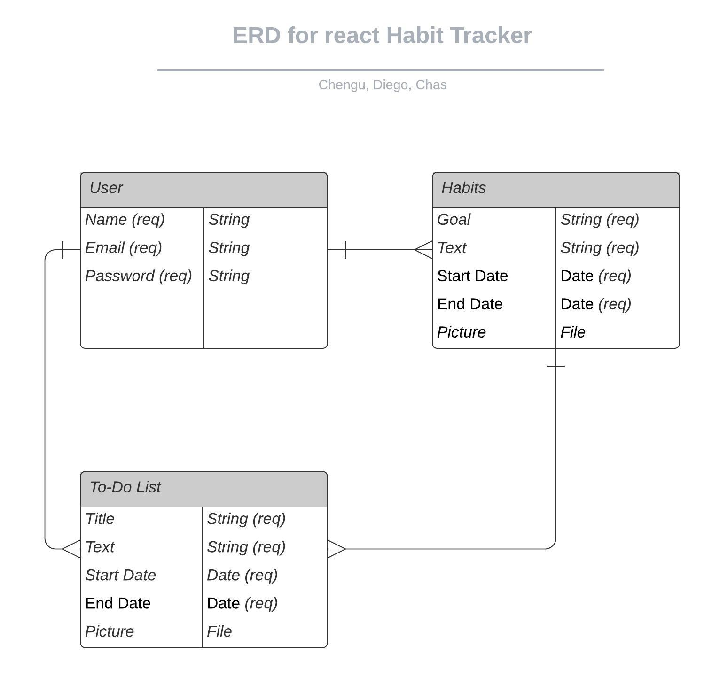

# Trello Board

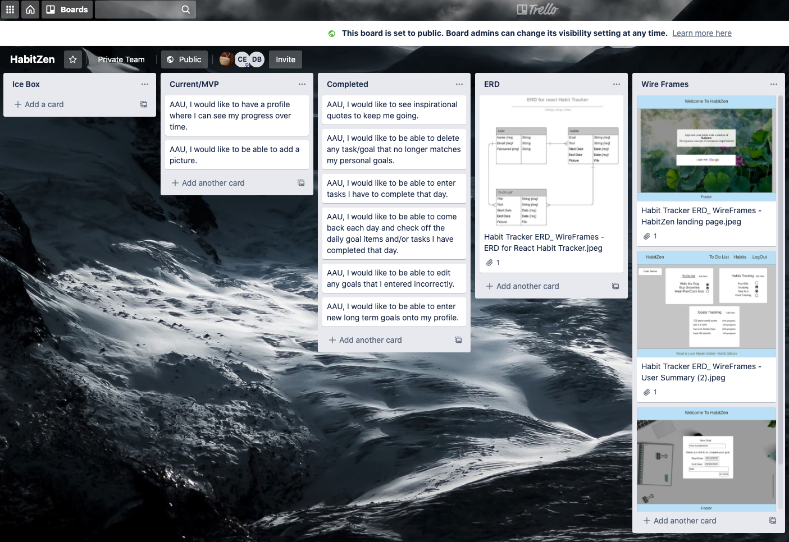
# Wire Frames

### Landing Screen
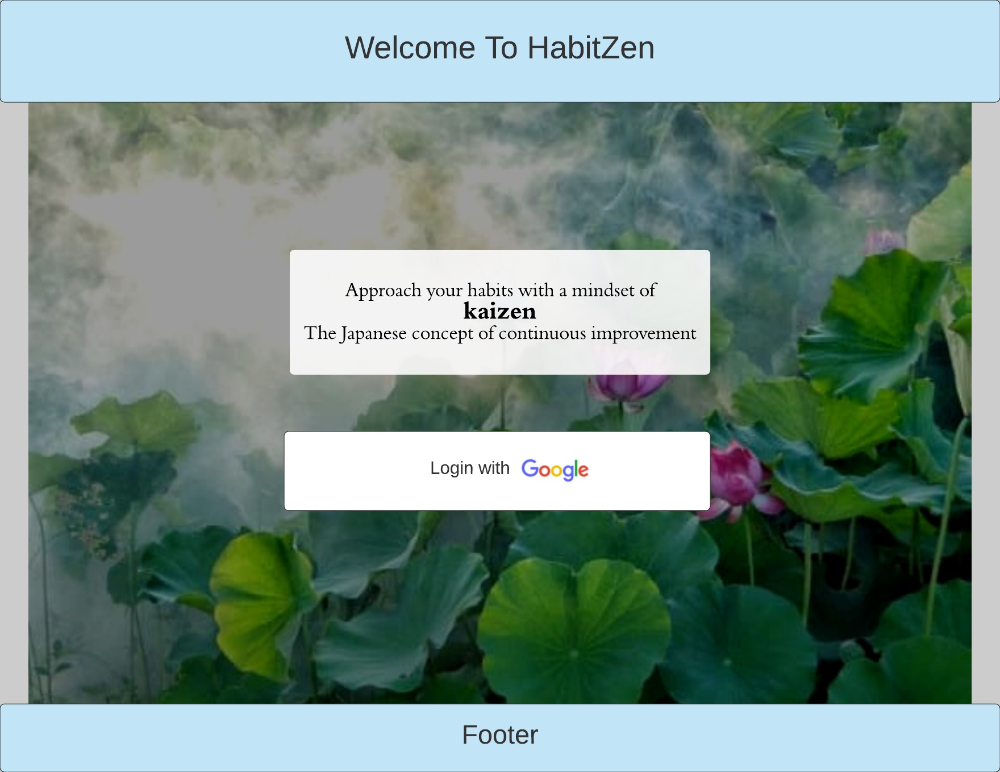

### Planned Input Form
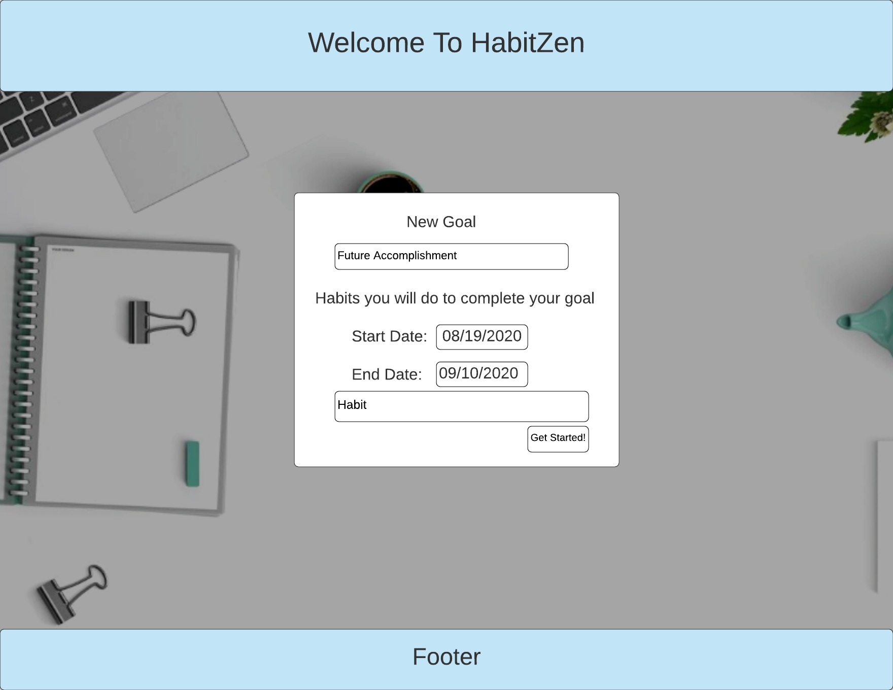

### Planned User Summary
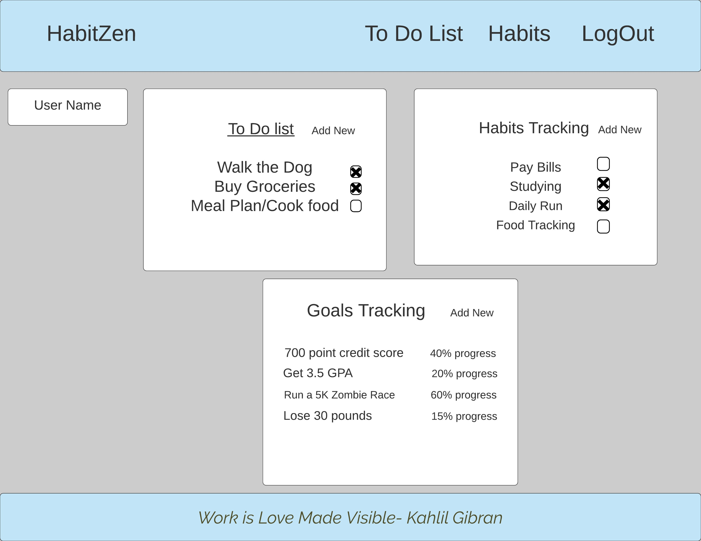

# Screenshots of Live App
### Landing Page
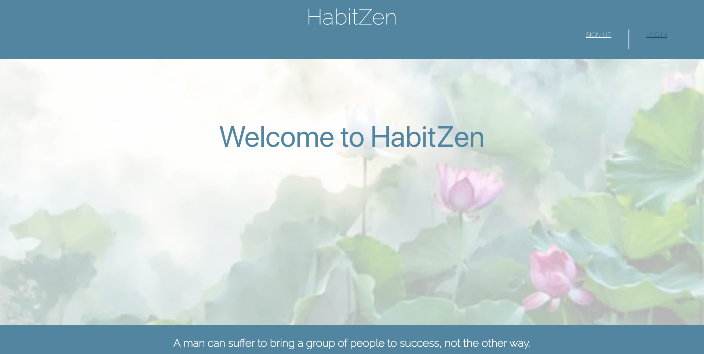
### Signin Page
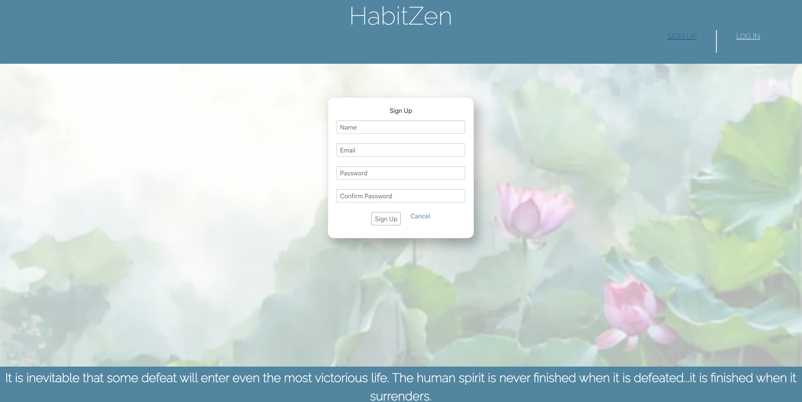
### Login Page
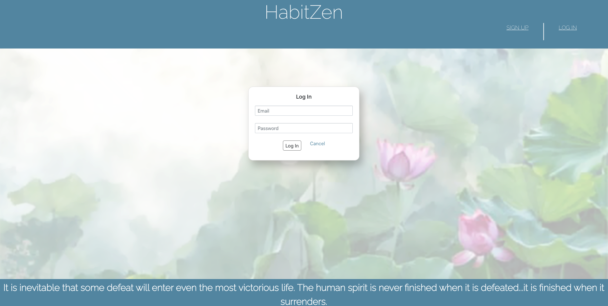
### Landing Page after Signin
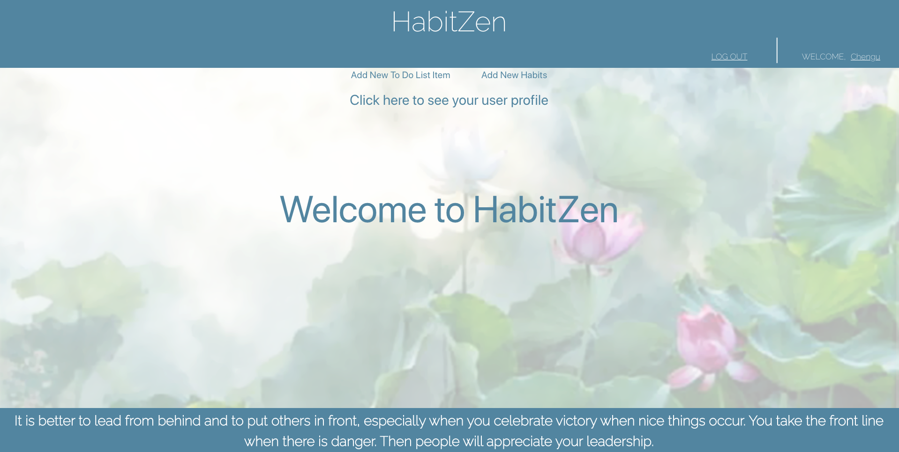
### Input form for To Do List
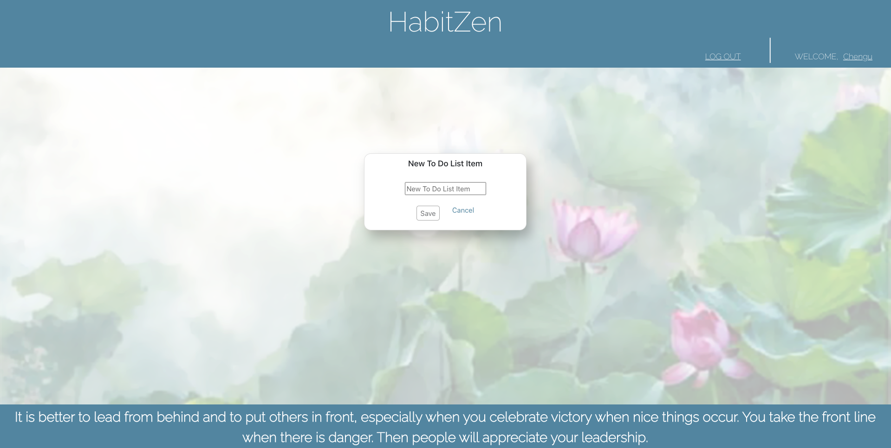
### Input form for Habits and Goals
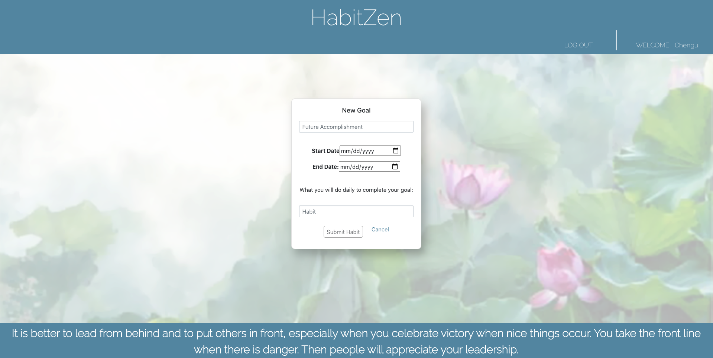
### User Profile Page
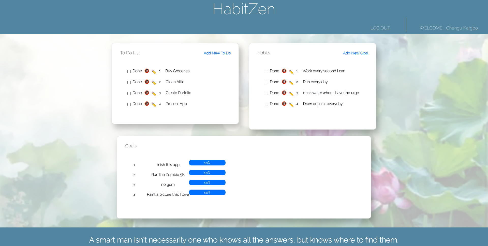

# Unresolved issues
* Unfortunately, within this time frame, we were unable to complete the full app functionality of a habit tracker. We do have functions that is meant to count the number of days between the start and end dates of a user's goal. We would need to update state as false every day and count each true (each habit completed on each day) to show the user their progress.

* The functions created are producing a number that is supposed to count the days from the start date of a user's goal to the end date. The number produced is supposed to 

* We did want to implement cloudinary to give the user the ability to post pictures, but we ran out of time.

# Future Enhancements

* In the future, we would like to be able to complete the full functionality as planned for the app. We would like to be able to provide the user with the ability to view their progress as they get closer to accomplishing their goals day by day.

* We would also like to give users the functionality to add a profile picture as well as add pictures to each habit or to do list item as they complete them.

# Link to Live App
Link to [HabitZen](https://habit-zen.herokuapp.com/)

# Authors who worked on Version 1
* Chengusoyane Kargbo 
* Chas Eubanks
* Diego Burgos

## Acknowledgments
Thank you to anyone who helped us get the app to this point. We will take your criticisms and encouragements onto build future versions of this app.